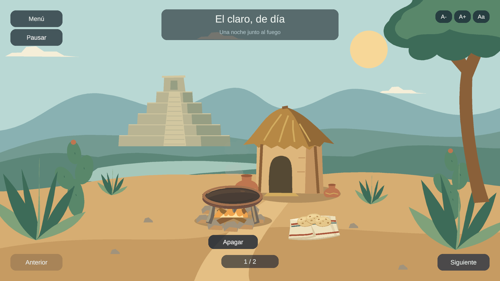
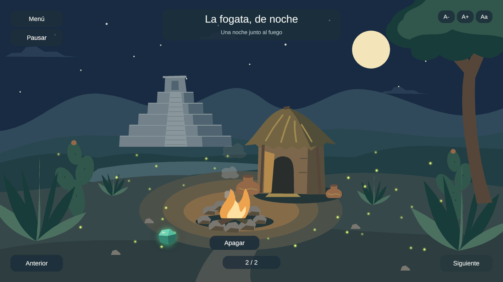

# Aplicación interactiva 2D

Una noche junto al fuego.

Proyecto de la unidad 2 de Optativa Abierta III, Diseño de videojuegos II (IH743), Licenciatura en Desarrollo de Sistemas Web, Universidad de Guadalajara, ciclo 2026-B.

- Alumno: Hiram Agustín Acevedo López.
- Asesor: Oscar Gregorio Silva Mares.
- Editor: Unity 6000.5.9f1. Plantilla Universal 2D, con URP e Input System.

Este repositorio es el proyecto de la unidad 2. Las demás unidades y el proyecto de la unidad 1 están en el [índice de proyectos de la materia](https://github.com/hiramAcevedo/ih743_Optativa_Diseno_Video_Juegos_II).

## Entregas de la unidad

Cada actividad continúa este mismo proyecto. Las etiquetas identifican el estado de cada entrega.

| Actividad | Contenido | Versión |
|---|---|---|
| 2.1. La primera ventana | Interfaz adaptable, tres botones, cuatro iconos y tres enlaces por costado | [act-2.1](https://github.com/hiramAcevedo/ih743_Aplicacion_Interactiva_2D/tree/act-2.1) |
| 2.2. El primer escenario | "Una noche junto al fuego": escena de día y de noche, navegación entre escenas y páginas, controles anclados | [act-2.2](https://github.com/hiramAcevedo/ih743_Aplicacion_Interactiva_2D/tree/act-2.2) |
| 2.3. Programación de botones | Objetos arrastrables con encaje, fuego controlable en ambas páginas, piedra con doble clic y control de fuentes | [act-2.3](https://github.com/hiramAcevedo/ih743_Aplicacion_Interactiva_2D/tree/act-2.3) |
| 2.4. El bucle de juego y la animación | Cinco bucles de animación de ocho cuadros (llama, llama baja, humo, luciérnagas, halo de la piedra), máscara en la base del fuego y bucle de juego con botón Pausar | [act-2.4](https://github.com/hiramAcevedo/ih743_Aplicacion_Interactiva_2D/tree/act-2.4) |
| 2.5. Detección de colisiones | Colisión real entre el comal y la fogata: el comal decide el estado de la llama al entrar y salir del área del fuego, con colisionadores alineados a los dibujos y sensores de Physics2D | [act-2.5](https://github.com/hiramAcevedo/ih743_Aplicacion_Interactiva_2D/tree/act-2.5) |

## Vista del escenario en la actividad 2.5

Capturas de Game view a 1920x1080, tomadas durante la prueba de la entrega 2.5.



De día, el comal está sobre la fogata y su presencia decide el estado del fuego: la llama baja se enciende debajo y los tres apoyos aparecen. Al retirarlo, la fogata vuelve a la llama alta.



De noche, las 34 luciérnagas parpadean cada una en su momento y el halo del chalchihuite late junto a las rocas. La página de noche no cambia en esta actividad.

## Abrir y probar

1. Clona el repositorio:

   ```bash
   git clone https://github.com/hiramAcevedo/ih743_Aplicacion_Interactiva_2D.git
   ```

2. En Unity Hub, abre Projects > Add > Add project from disk. Selecciona la carpeta clonada, donde están `Assets`, `Packages` y `ProjectSettings`.
3. Ábrela con Unity 6000.5.9f1. La primera importación genera `Library` y puede tardar varios minutos.
4. En la ventana Project, abre `Assets/Scenes/PrimeraVentana.unity` con doble clic. Verifica que Hierarchy diga "PrimeraVentana" antes de ejecutar.
5. Abre Window > General > Console y presiona Play.
6. Prueba los botones Inicio, Ayuda y Créditos. Cada uno cambia el texto central y resalta la sección elegida.
7. Prueba los seis enlaces de los costados. Abren el navegador: perfil de GitHub, código del proyecto, UDG, dos videos de YouTube y manual de Unity. Requieren conexión a internet.
8. Prueba los botones "A-", "A+" y "Aa" bajo la columna derecha. Los dos primeros reducen o agrandan todos los textos (entre 0.8x y 1.2x); "Aa" alterna entre Liberation Sans y Alegreya. El ajuste se conserva al cambiar de escena.
9. Presiona "Escenario" en la esquina inferior derecha. Debe abrir "El claro, de día", con el indicador "1 / 2" y Anterior desactivado, y con la tipografía elegida en el menú.
10. Arrastra el comal hacia el círculo de piedras: se acomoda sobre tres apoyos, incluso con el fuego apagado. Presiona "Encender": aparece una llama baja debajo del comal; "Apagar" la oculta. Las tres tortillas se acomodan al soltarlas sobre el comal y lo acompañan si lo mueves. Puedes retirar cada tortilla por separado. Al retirar el comal desaparecen los tres apoyos y regresa la forma libre de la llama. Los apoyos reaparecen cuando se acomoda el comal sobre la fogata. Fuera de las zonas de encaje los objetos se quedan donde se sueltan y no salen de la pantalla.
11. Presiona Siguiente: aparece "La fogata, de noche", con "2 / 2", la llama encendida y Siguiente desactivado. "Apagar" oculta la llama y la luz sobre el suelo y la pared; "Encender" las restaura. Haz doble clic sobre el chalchihuite para alternar su halo y arrástralo: la sombra desaparece al levantarlo. Un arrastre no cambia el brillo. Anterior regresa al día y conserva las posiciones y el fuego de esa página; Menú vuelve a PrimeraVentana.
12. Con el fuego encendido, observa la fogata: la llama cambia de forma unas doce veces por segundo y el humo sube en bocanadas que se desvanecen. Con el comal puesto, la llama baja parpadea debajo del comal. De noche, las luciérnagas parpadean cada una a su ritmo y el halo del chalchihuite pulsa. Cada bucle recorre ocho cuadros y vuelve al primero sin salto.
13. Presiona "Pausar", bajo "Menú": todos los bucles se congelan en su cuadro actual y el humo deja de mecerse; el botón pasa a "Reanudar". En pausa el arrastre y los demás botones siguen funcionando. "Reanudar" vuelve a poner todo en marcha. La pausa se conserva al cambiar de página.
14. Arrastra el comal y suéltalo fuera de la fogata: la llama sigue alta y los apoyos no aparecen. Acércalo al círculo de piedras: en cuanto su caja entra en el área del fuego, aunque no lo hayas soltado, la llama se vuelve baja y aparecen los tres apoyos; al soltarlo, el comal se acomoda sobre ellos. Retíralo y todo vuelve a como estaba. Ese cambio lo decide la colisión, no la posición del puntero: el área del fuego es un sensor invisible dentro de la llama, y el comal lleva su propio cuerpo y su colisionador. El botón "Encender" y "Apagar" sigue funcionando igual, y las tortillas siguen encajando en el comal como antes.
15. En Game view, prueba 1920x1080, 1024x768 y 900x1200. Se pueden añadir desde el botón "+" del selector de resolución, con Type = Fixed Resolution. Revisa ambas páginas y los tres botones de fuente en sus extremos. El fondo debe cubrir la vista y los textos y controles deben permanecer dentro de la ventana, sin superponerse. En vertical se recorta parte del paisaje lateral; el jacal y la fogata permanecen visibles.
16. Presiona Play de nuevo para detener la ejecución.

## Organización

- `Assets/Scenes/PrimeraVentana.unity`: menú de la aplicación (actividad 2.1).
- `Assets/Scenes/Escenario.unity`: el escenario "Una noche junto al fuego", con dos páginas (actividad 2.2).
- `Assets/Scripts/VentanaPrincipal.cs`: contenido y selección de los tres botones.
- `Assets/Scripts/EnlaceWeb.cs`: apertura de las direcciones externas.
- `Assets/Scripts/Navegacion.cs`: carga de PrimeraVentana y Escenario.
- `Assets/Scripts/Paginas.cs`: alternancia de páginas, indicador y límites de navegación.
- `Assets/Scripts/ArrastreSprite.cs`: arrastre de una imagen de UI con mouse o dedo mediante `IBeginDragHandler`, `IDragHandler` e `IEndDragHandler` (actividad 2.3). Está en el comal, las tres tortillas y el chalchihuite.
- `Assets/Scripts/Fogata.cs`: enciende y apaga la llama y la luz desde OnClick; cambia la forma de la llama cuando el comal está colocado.
- `Assets/Scripts/EncajeObjeto.cs`: acomoda el comal en la fogata y las tortillas en el comal. En el comal la condición es la colisión con el área del fuego; en las tortillas sigue siendo su zona de encaje.
- `Assets/Scripts/BrilloPiedra.cs`: alterna el halo por doble clic y retira la sombra al arrastrar.
- `Assets/Scripts/ColisionComal.cs`: el comal contra el área de la fogata (actividad 2.5). Detecta la entrada y la salida con `OnTriggerEnter2D` y `OnTriggerExit2D`, avisa a `Fogata` para que cambie la forma de la llama y ajusta el tamaño de los dos colisionadores al de su imagen cuando cambia la proporción de la pantalla.
- `Assets/Scripts/BucleEscena.cs`: el bucle de juego (actividad 2.4). En `Update` varía la velocidad de las llamas con ruido, mece el humo y controla la pausa; "Pausar" y "Reanudar" lo llaman desde OnClick.
- `Assets/Scripts/Luciernaga.cs`: al activarse, arranca la animación de cada luciérnaga en una fase distinta, para que no parpadeen al unísono.
- `Assets/Animaciones/`: un clip y un controlador por bucle (Llama, LlamaBaja, Humo, Luciernaga, HaloPiedra), cada clip con ocho keys de sprite y Loop Time.
- `Assets/Scripts/ControlFuentes.cs` y `AjustesTexto.cs`: tamaño y tipografía de todos los textos, con el estado en una clase estática para que sobreviva al cambio de escena.
- `Assets/Fonts/`: Alegreya Regular con su licencia OFL y el Font Asset generado para TextMesh Pro.
- `Assets/UI/`: iconos y panel del menú.
- `Assets/UI/Escenario/`: ilustraciones de día y noche a 2400x1350, con formas planas y luz por capas. El fondo nocturno y su capa de luz se activan por separado; las luciérnagas ya no están pintadas en el fondo. En `props/` van el comal, la tortilla, la servilleta, los apoyos y las partes del chalchihuite; en `animaciones/` van los ocho cuadros de cada bucle, en su carpeta.
- `Assets/Settings/`: configuración de Universal Render Pipeline y entrada de la plantilla.
- `Assets/TextMesh Pro/`: recursos de texto y licencia de la fuente Liberation Sans.
- `Capturas/`: las dos imágenes de este README, fuera de `Assets` para que Unity no las importe.

El Canvas usa "Scale With Screen Size", referencia 1920x1080 y ajuste equilibrado entre ancho y alto. Las anclas sitúan los bloques; los grupos de distribución ordenan botones e iconos. TextMeshPro ajusta el tamaño del texto al espacio disponible.

El escenario usa un fondo con "Envelope Parent" para llenar la pantalla conservando su proporción. Los botones se anclan a sus esquinas y los textos al borde superior o inferior. PrimeraVentana y Escenario están registradas en la lista de escenas de compilación. Las luciérnagas siguen siendo parte de la ilustración estática.

Los objetos arrastrables y la llama son imágenes de UI ancladas proporcionalmente al fondo, de modo que acompañan a la ilustración en cualquier proporción de pantalla. El Canvas está en Screen Space Overlay. El arrastre convierte el desplazamiento del puntero al espacio del padre y actualiza las anclas proporcionales; así conserva la posición relativa al cambiar de resolución. Acota el objeto al rectángulo del Canvas y lo coloca al frente al levantarlo. Las tortillas colocadas siguen los puntos de apoyo del comal. El encaje usa zonas de UI, sin gravedad ni colisiones físicas. Como los textos usan ajuste automático de tamaño, el control de fuentes escala sus límites `fontSizeMin` y `fontSizeMax`; al agrandar conserva el mínimo original para que ningún texto se desborde de su caja.

Cada bucle de animación es un `AnimationClip` que cambia el sprite de una imagen de UI en ocho keys, con Loop Time, tal como en el video 6 de Natalie C, y un Animator con ese clip como único estado. Las llamas corren a doce cuadros por segundo, el humo a ocho, las luciérnagas y el halo a seis. Los cuadros se dibujaron por programa con la misma paleta de la ilustración y cierran el ciclo: el octavo empalma con el primero. La base de la llama se recorta con un componente Mask sobre una imagen transparente, como en el video 07, para que el fuego nazca limpio sobre la leña.

El bucle de juego es `BucleEscena.cs`: cada cuadro acumula el tiempo de la escena, modula la velocidad de las llamas entre 0.85 y 1.15 con ruido Perlin (por eso el fuego no parpadea con regularidad mecánica) y desplaza el humo con una senoide. La pausa pone a cero la velocidad de todos los Animators y congela el vaivén sin tocar `Time.timeScale`, de modo que la interfaz sigue respondiendo.

La detección de colisiones usa el motor de física en dos dimensiones sobre la interfaz: el comal lleva un cuerpo cinemático sin gravedad y un colisionador de caja marcado como sensor, y la fogata un área con su propio cuerpo estático. Al entrar y salir, Unity llama a `OnTriggerEnter2D` y `OnTriggerExit2D`, y ese aviso es el que cambia el estado del fuego. El resto del escenario no tiene física: el arrastre sigue moviendo las anclas del rectángulo, y el sensor solo mira si las dos cajas se tocan.

El colisionador del comal coincide con su dibujo y el área del fuego es un núcleo del tamaño de la llama, no el círculo de piedras: si abarcara todo el fuego, el comal en su posición inicial ya lo tocaría y la fogata arrancaría con la llama baja. Los dos tamaños se recalculan desde el rectángulo de cada imagen, porque las anclas son proporcionales al fondo y la proporción de la pantalla cambia ese rectángulo. Así la caja sigue pegada al dibujo en 1920x1080, en 1024x768 y en 900x1200.

Se versionan `Assets`, `Packages` y `ProjectSettings`, incluidos los archivos `.meta`. `Library`, `Temp`, `Logs`, `UserSettings` y compilaciones quedan fuera por el `.gitignore`.

## Material consultado

[Febucci: How to create UI for all Resolutions](https://www.febucci.com/2018/10/unity-ui-tutorial/). Se aplican el escalado del Canvas, las anclas y los grupos de distribución descritos en el tutorial.

Natalie C. (2017, 14 de julio). [Interactive book 02 Aspect ratio and Artwork](https://www.youtube.com/watch?v=OsOVmiDY41I) e [Interactive Book 03 Setting up a scene in Unity, Aspect ratios & buttons](https://www.youtube.com/watch?v=6jKU1eVFGqI). Se aplican el encuadre para distintas proporciones, el ajuste de la escena y el anclaje de controles.

Natalie C. (2017, 7 de julio). [Interactive book 04 Scripting Navigation](https://www.youtube.com/watch?v=4M9zbOhBYUk) y (2017, 28 de julio) [Interactive Book5 dragging a sprite](https://www.youtube.com/watch?v=vA63AYdV2Os). Se aplican los scripts pegados a objetos y llamados desde OnClick, y las interfaces de arrastre del EventSystem. La conversión de coordenadas se adapta a un Canvas en Screen Space Overlay.

Natalie C. (2017, 28 de julio). [Interactive book 6 Loop Animation](https://www.youtube.com/watch?v=2eB3Nq9f2OY) y (2017, 27 de julio) [Interactive Book 07 masking](https://www.youtube.com/watch?v=jv4eMPMQc9k). Se aplican el clip de animación por keys de sprite con Loop Time y la máscara que recorta la base de las llamas. Los clips se generan por script del editor con el mismo resultado que la ventana Animation.

Natalie C. (2017, 27 de julio). [Interactive Book 08 Collision detection](https://www.youtube.com/watch?v=0SpFBVV0WAo). Se aplica el cuerpo sin gravedad con su colisionador de caja, el sensor en el objeto que se arrastra y el del área que lo recibe, y la comprobación en consola de que las áreas se están tocando.

La fuente Liberation Sans conserva su licencia en `Assets/TextMesh Pro/Fonts/LiberationSans - OFL.txt`. Alegreya, de Juan Pablo del Peral (Huerta Tipográfica), se obtuvo de [Google Fonts](https://fonts.google.com/specimen/Alegreya) bajo la SIL Open Font License 1.1; la licencia está en `Assets/Fonts/Alegreya - OFL.txt`. Los videos se enlazan en YouTube; no se incluyen sus archivos de audio o video.

## Repositorios de la materia

- [Índice de proyectos de IH743](https://github.com/hiramAcevedo/ih743_Optativa_Diseno_Video_Juegos_II): entregas de todas las unidades y el proyecto de la unidad 1.
- Este repositorio: proyecto de la unidad 2, actividades 2.1 a 2.6.
